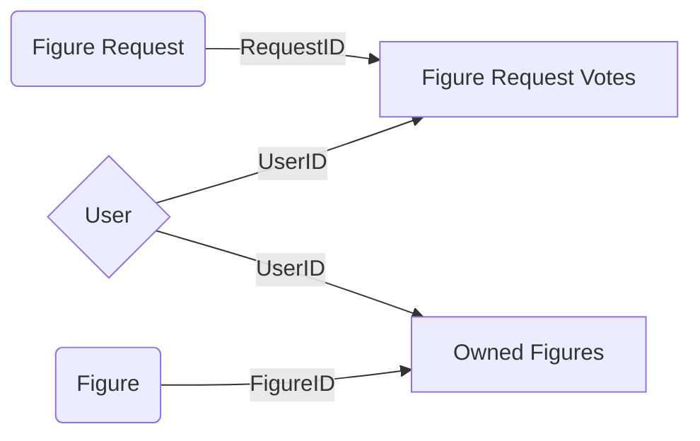

# Toozdroid

Toozdroid **v2** update is complete, fixed efficiency issues, changed most of the database design and rearranged the code in '*nodes*'.

## Setup

 1. Create a **.env** file with the following:
 > BOT_TOKEN=\<Token>
 > DB_URL=\<URL for Mongoose DB>
 2. Install npm dependencies: **mongoose** *5.9.10*, **axios** *0.19.2*, **dotenv** *8.2.0*, **discordjs** *12.2.0*
 3. Run The bot and make sure a file named **config.json** has been created. If the file hasn't been created check the bot file perms and make sure it can read and write.

## Changelog

**Efficiency Fixes:**

 - The `Figure requests` table has a votes field witch is updated every time someone *votes*/*unvotes* it.
 - To keep track who voted there is now a **many to many** relationship `Figure Requests Votes` table.
 - Most of the commands have been moved to an *asynchronous* style.

**Bug Fixes:**
 - Wiki List and Request Lists can no longer be stuck on an infinite loop

**QOL Improvements:**
 - Reorganized the code in modules, each main function (config, collections, requests and wiki) is now in a separate module and can be changed/removed without affecting other functionality.
 - New *Help Menus* look
 - *Quick Menu Buttons* on the main help menu;

## New DB Design

### Table Contents

|Figure Requests    |Figure Requests Votes|Figures|Owned Figures|Role Rules|
|:-------------------:|:---------------------:|:-------:|:-------------:|:----------:|
|ID                 |ID                   |ID     |ID           | RoleID|
|Votes              |VoterID              |Name   |UserID       | Figure Amount|
|Figure Name        |                     |EmojiID|FigureID     |
|Username of first person who requested|  |       |Code         |

 

| Wiki Entries | 
| :------------: |
| Name |
| Description |
| Image URL |
| Price |
| Color |
| Release Date |
| Status |
| Author |

### Table Relations

